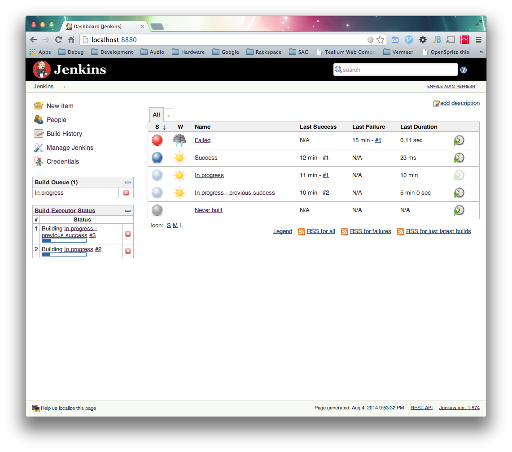
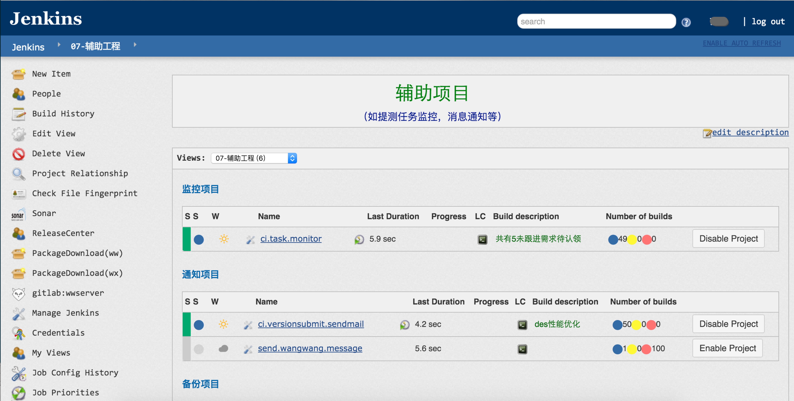

# Jenkins Bob UI Theme
[原作地址](https://github.com/rackerlabs/canon-jenkins)

CSS and JS to implement as a theme for [Jenkins CI](http://jenkins-ci.org/).

### Before



### After



## CDN URLs

**Note:** these URLs are for the Jenkins UI redesign as of 1.572. For the legacy UI theme files, please see `Legacy Jenkins UI (pre-1.572) CDN URLs` below

## Usage

1. Install the [Simple Theme Plugin for Jenkins](https://wiki.jenkins-ci.org/display/JENKINS/Simple+Theme+Plugin)
2. Clone the repo, put it into the JENKINS_HOME/userContent, for e.g: /var/lib/jenkins/userContent/css
3. Navigate to Jenkins > Manage Jenkins > Configure System > Theme
4. Set _URL of theme CSS_ to `/var/lib/jenkins/userContent/css/style.css` (or another URL of your setting/choosing)
5. Set _URL of theme JS_ to `/var/lib/jenkins/userContent/css/app.js` (or another URL of your setting/choosing)

## Building

```
npm install
grunt
```

## To manually change SimpleTheme CSS and JS values

1. Edit: `$JENKINS_HOME/org.codefirst.SimpleThemeDecorator.xml` with code below
2. Restart Jenkins

```
<?xml version='1.0' encoding='UTF-8'?>
<org.codefirst.SimpleThemeDecorator plugin="simple-theme-plugin@0.3">
  <cssUrl>your custom path</cssUrl>
  <jsUrl>your custom path</jsUrl>
</org.codefirst.SimpleThemeDecorator>
```

